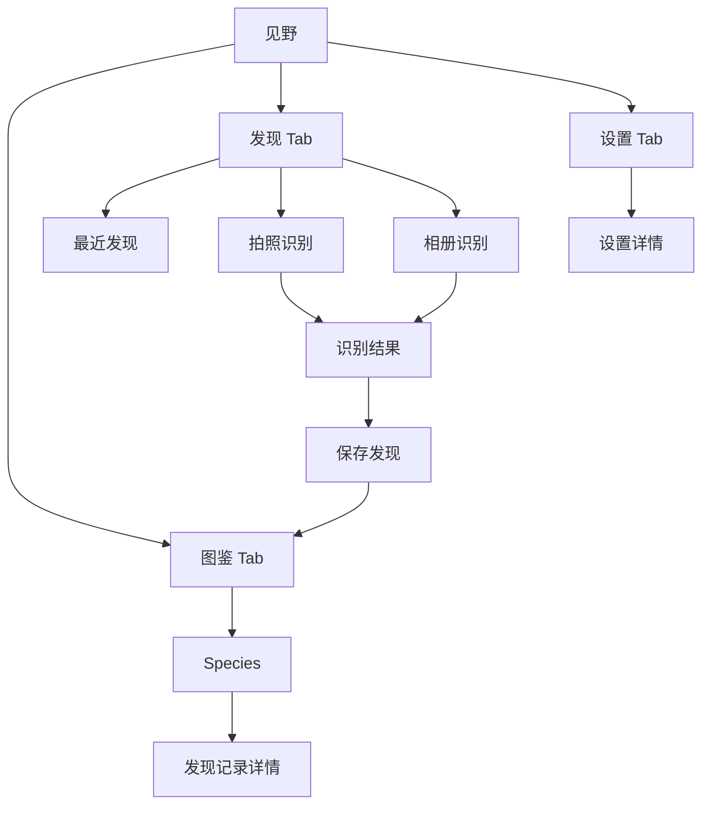
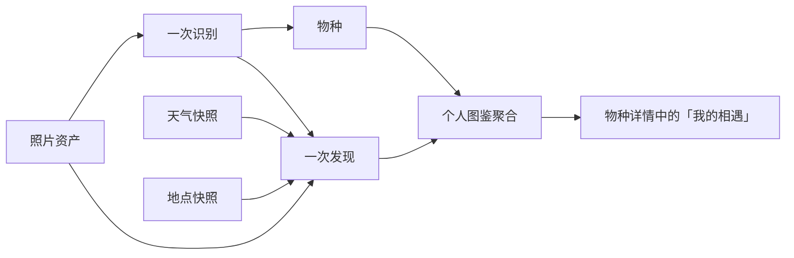

# 见野 V1 信息架构

> 实施注记（2026-08-17）：当前一级入口为“图鉴 / 发现 / 设置”。相册、系统相机、图鉴搜索和排序、设置详情已接入；真实位置、天气、地图、待确认发现和单条记录编辑删除仍未实现。详见 [PROJECT_STATUS.md](PROJECT_STATUS.md)。

## 架构原则

1. 以“发现记录”而不是“植物”作为用户数据的中心。
2. 物种是知识对象；发现是用户的生活对象；个人图鉴是两者的聚合视图。
3. V1 只开放植物，但任何一级结构都不用 `Plant` 作为通用命名。
4. 发现、图鉴、设置三处信息应互相可达，但不复制业务状态。

## 一级入口



| 一级入口 | 用户意图 | 主内容 | 关键动作 |
|---|---|---|---|
| 发现 | 此刻收录一场相遇 | 拍照识别、相册识别、最近发现、图鉴引导 | 创建识别任务、查看最近记录 |
| 图鉴 | 回看我遇见过什么 | 最近相遇、个人图鉴列表、搜索和排序 | 浏览物种、进入物种相遇集合 |
| 设置 | 管理本地服务与权限 | 存储、数据来源、外观、权限、语言、协议、反馈与版本 | 清理缓存、管理本机数据与授权 |

## 页面层级

```text
首页 / 发现
├── 拍照识别（原生相机 / 相册）
│   └── 识别结果
│       └── 收入我的图鉴
│           └── 返回图鉴
├── 最近发现
│   └── 物种详情
└── 图鉴进度
    └── 我的图鉴

我的图鉴
├── 搜索与排序
├── 物种详情
│   ├── 我的相遇列表
│   │   └── 发现记录详情
│   └── 未来入口：「我也在养它」
└── 地图足迹（未来能力，当前未实现）

设置
├── 订阅服务说明
├── 占用空间与本机数据
├── 图片识别来源 / 植物知识来源
├── 外观与语言
├── 权限、隐私政策与服务协议
└── 反馈、版本与评分入口
```

## 关键对象与视图关系



### 不能混淆的三个概念

| 概念 | 含义 | 示例 |
|---|---|---|
| 物种 `Species` | 对自然生命的知识描述，可被多人复用 | 紫薇 / *Lagerstroemia indica* |
| 一次发现 `Discovery` | 用户在特定时间、地点、照片中遇见它的记录 | 2026-08-10 在上海世纪公园拍到的一株紫薇 |
| 我的图鉴条目 `CollectionEntry` | 对用户多次发现同一物种的个人聚合 | “我遇见紫薇 4 次” |

## 多生物类群扩展策略

V1 入口和内容均显示“植物”，当前模型字段名为 `category`，取值与未来扩展边界为：

```text
category = plant | insect | bird | fungi | other
```

未来只需为新的类群补充识别模型、物种资料字段、筛选项和详情模块；发现、照片、地点、天气、图鉴聚合、隐私和数据管理仍使用同一套对象。
