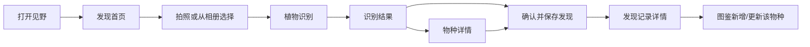

# 见野 WildSight · V1 产品定型

> 实施注记（2026-08-17）：本文是产品目标，不是功能完成清单。当前已实现相册/相机识别、正式 HTTPS、图鉴与发现本地持久化、基础搜索排序和设置中心；真实定位天气、待确认发现、单条记录编辑删除、账号与云同步仍未实现。实时状态见 [PROJECT_STATUS.md](PROJECT_STATUS.md)。

## 1. 产品定义

**见野**是一个帮助用户发现、认识、收藏和记录身边自然的个人自然图鉴 App。

它服务于这样一次真实的相遇：看见一个自然生命，拍下来，知道它是什么，了解它，收藏进自己的图鉴，并留下相遇的时间、地点和照片。日积月累，这些相遇成为用户自己的自然记录，而不是一份通用植物百科。

V1 仅识别与收录**植物**。信息架构和数据模型从第一天起保留 `organismGroup`（生物类群），以便未来扩展昆虫、鸟类、真菌和其他自然生物。

### V1 的产品承诺

- 用户第一次使用后能立即理解：**“这是收藏我亲自遇见过的自然的地方。”**
- 发现是核心；物种百科是解释层；收藏和记录是记忆层。
- AI 给出候选与置信信息，用户拥有最终确认权。
- 位置和天气是可选的观察上下文，不是使用门槛。
- “我在养”不进入 V1 一级导航；物种页仅预留未来入口。

### 不是什么

- 不是植物养护、浇水提醒或任务打卡 App。
- 不是覆盖全网物种的通用百科工具。
- 不是社交晒图或游戏化收集产品。
- 不使用或复刻任何 Linfa 的 UI、页面结构、品牌视觉、图标、文案与源码。

## 2. 名称判断

### 中文名：见野

中文名与“看见野外自然”的核心体验一致，短、可记忆，也有安静的观察感。它适合作为面向中国用户的主品牌名。

### 英文名：WildSight

`WildSight` 语义清晰，适合作为英文副名，但不宜直接视为可注册或可独占名称。

- 截至 2026-08-13 的公开网页和中国大陆应用商店可检索索引，**未检出可明确确认的同名中国大陆在架 App**。
- 但全球已存在同名自然/野生动物项目，例如加拿大自然保护组织 Wildsight，以及一个名为 WildSight 的 AI 野生动物识别项目；存在品牌混淆风险。
- 此次为公开检索，不覆盖华为、小米、vivo、OPPO、苹果中国区所有实时的封闭式商店索引，也不构成商标检索或法律意见。

**建议：**产品原型继续使用“见野 / WildSight”；正式上架与融资传播前，在中国商标网检索第 9 类（软件）、第 42 类（软件服务）及近似中文/英文名称，并进行专业商标可用性核验。也可预备 `JianYe Nature`、`Wild Encounters` 等英文备选名。

## 3. V1 核心用户流程

### 主链路



### 首次使用：30 秒理解路径

1. 首屏只说明一句：**“把你遇见的自然，收进自己的图鉴。”**
2. 首页用一个占据视觉中心的“拍照发现”入口，且相册入口紧邻其旁。
3. 用户拍摄/选择植物照片，完成识别后看到候选物种与“保存这次相遇”。
4. 保存成功页明确反馈：**“已收录进你的图鉴 · 这是第 1 次遇见它。”**

不要求用户登录、不要求定位、不要求填写完整笔记。先完成一次收藏，再逐步邀请补充时间、地点与感受。

### 保存规则

- 识别结果**不自动入馆**。用户点击“保存这次发现”后才创建 `Discovery`。
- 保存发现会自动把对应物种加入个人图鉴；若已收录，则更新该物种的发现次数、最近时间与最近地点。
- 用户可关闭“收藏到图鉴”，仅保留私密发现记录；默认开启，但保存前可见、可修改。
- 低置信度或未识别成功时，也允许保存为“待确认的植物发现”；不能把不确定对象伪装成确定物种。

## 4. V1 页面边界：7 个主要页面

| # | 页面 | 任务 | V1 核心内容 |
|---|---|---|---|
| 01 | 首页 / 发现 | 激发观察与启动识别 | 日期、弱天气、自然短句、拍照发现、相册识别、最近发现、图鉴进度、轻量推荐 |
| 02 | 拍照识别 | 获取一张适合识别的照片 | 相机拍摄、相册选择、构图/清晰度提示、确认重拍 |
| 03 | 识别结果 | 理解和确认 AI 候选 | 主候选、候选列表、置信提示、查看物种、保存这次发现、重新识别 |
| 04 | 物种详情 | 认识一个物种 | 中文名、学名、分类、特征、简介、分布、花期、毒性/宠物安全、相关摄影、我的相遇 |
| 05 | 我的图鉴 | 浏览“我亲自遇见过的物种” | 物种栅格、分类/月份筛选、首次与最近相遇、重复遇见次数、图鉴统计 |
| 06 | 发现记录详情 | 保存一次具体相遇 | 照片、物种/待确认状态、日期时间、地点、天气、备注、编辑、删除 |
| 07 | 我的 / 设置 | 管理个人数据与权限 | 个人馆藏摘要、定位/照片/通知权限、隐私、数据导出预留、关于见野 |

### 二级界面，不单列为主要页面

- 相册选择器与原生相机界面。
- 图鉴的分类/筛选面板。
- 记录的编辑底部弹层。
- 物种详情中的“我也在养它”未来入口：仅展示“即将推出”，不承载养护功能。

## 5. 底部导航与拍照入口

### 推荐方案：三个一级入口 + 中央发现按钮

```text
图鉴     [ 发现 ]     我的
             ↑
        固定中央主操作
```

- **发现**：不是普通 Tab，而是居中的主操作。点击后弹出“拍照发现 / 从相册识别”操作面板，直接进入核心流程。
- **图鉴**：进入个人馆藏，而不是公共植物百科。
- **我的**：设置、权限、个人数据与未来能力入口。
- **首页 / 发现页**：作为应用默认落地页，可通过底部中央“发现”按钮的长按或再次点击回到首页；实现阶段也可将其作为隐藏的根页面，而不增加第四个底部标签。

### 推荐原因

1. 拍照识别是最高频、最高价值的动作，应拥有最短路径和最强视觉权重。
2. 只有三个稳定的导航目的地，降低第一版学习成本，避免变成养护工具的传统四 Tab 结构。
3. 首页承载“出去看看”的情绪，而中央按钮承载“此刻发现”的行动；两者互补，不互相竞争。

### 不采用的方案

- 不采用“首页 / 植物 / 提醒 / 设置”：会强化养护与待办心智。
- 不把相机仅放在首页右上角：对核心动作的可发现性不足。
- 不让相机拍摄后直接自动保存：用户需要保有确认物种和是否入馆的控制权。

## 6. 首页 / 发现页定义

首页不是数据看板，而是一张邀请用户出门观察的“当日展签”。

### 内容顺序

1. **时间与环境**：日期、城市级天气/温度（定位允许时显示；弱化，不做天气卡片）。
2. **自然短句**：每日一条克制的观察邀请，例如“今天，留意路边正在开花的植物。”短句不使用鸡汤或任务口吻。
3. **主视觉与拍照发现**：一张真实自然摄影背景或摄影留白上叠加主按钮；相册识别为文字次操作。
4. **最近发现**：最近 1–3 次个人发现，以照片为主，让用户看到个人档案正在形成。
5. **图鉴进度**：只用一句摘要，例如“已遇见 18 种植物，8 月新增 3 种。”链接到图鉴。
6. **轻量推荐**：一个季节/场景相关的植物观察提示，V1 由内容服务端提供或使用离线内容；不做信息流。

### 空状态

没有发现记录时，首页仍以主拍照入口为中心，文案为“从一次相遇开始，建立你的自然图鉴。”不出现盆栽、浇水、任务清单或卡通插画。

## 7. 我的图鉴定义

图鉴表达的是“我亲自遇见过的自然”，不是按全量物种罗列的百科。

### 物种馆藏卡应呈现

以用户实拍图作为主图，每张卡最少展示：

- 中文名与学名（学名为低权重展签信息）。
- **我遇见过 N 次**。
- 第一次相遇：日期 + 城市/地点摘要。
- 最近一次相遇：日期 + 城市/地点摘要。
- 发现月份集合，例如“见于 5、7、8 月”。
- 可选标签：收藏、待确认、宠物留意等。

### 物种详情中的个人维度

```text
紫薇  Lagerstroemia indica

我遇见过 4 次
第一次  2026.07.12 · 杭州
最近一次 2026.08.10 · 上海
常见于 7–8 月
地点      西湖边、世纪公园、住处附近
```

点击后进入对应发现记录集合；每一次相遇都有自己的照片、时间、地点、天气与笔记。

### V1 图鉴筛选

- 植物（V1 的唯一可用类群，但视觉上保留类群筛选位置）。
- 首次收录时间。
- 最近遇见时间。
- 发现月份。
- 收藏状态。
- 已确认 / 待确认。

地图足迹只展示“即将推出”占位，不在 V1 实现地图页面或地图 SDK。

## 8. V1 明确不做

设置中心中的订阅入口仅说明“正在规划”，不包含价格、支付、账号、云同步或虚构权益。语言页当前只提供简体中文；未来界面翻译与知识内容翻译分开管理，知识应按 locale 维护版本，未审核知识不得用运行时模型自动翻译。

- 植物养护、提醒、浇水/施肥打卡、成长时间线。
- 昆虫、鸟类、真菌的实际识别能力。
- 地图足迹和地图可视化。
- 社区、关注、评论、公开动态。
- 游戏化等级、连续打卡、积分、徽章。
- 云同步、账号体系、跨设备数据合并。
- AI 病害诊断、自动养护建议或不经确认的自动物种入库。

## 9. 成功标准

- 新用户能够在首次会话完成“拍摄/选图 → 识别 → 保存发现”的闭环。
- 用户能在图鉴中清楚看到“自己何时何地遇见过这个物种”。
- 首页、底部导航和文案没有让用户误解为养护或待办 App。
- 所有 V1 数据从一开始即可演进到多生物类群，而无需把 `Plant` 重构为更通用的实体。
