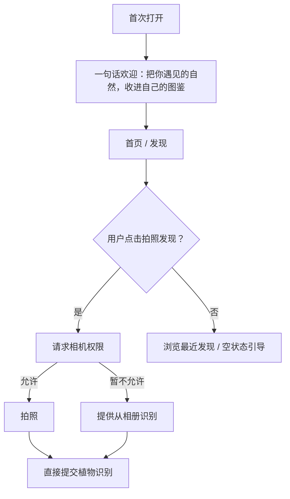
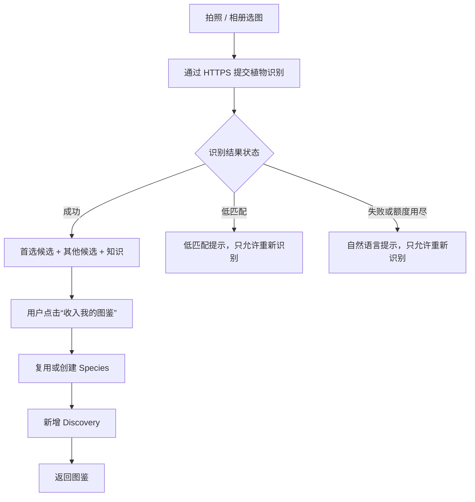
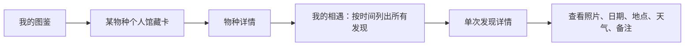

# 见野 V1 用户流程

> 实施注记（2026-08-17）：当前真实可用主链路是“**拍照或从相册选择 → 真实识别 → 收入我的图鉴 → 本地 Species + Discovery**”。保存待确认发现、补充真实地点天气、单条记录编辑删除仍未实现；产品目标与当前实现差异在各节明确说明。

## 1. 首次打开



### 权限策略

- 首次只在用户主动点击“拍照发现”时请求相机权限。
- 相册通过系统 PhotoPicker 选择单张图片，不申请整库读取权限。
- 当前不声明或请求位置、天气、通知权限。
- 网络用于用户主动发起的识别和知识刷新；首次识别前先展示隐私处理提示。
- 当前相机和相册返回 URI 后会直接进入识别，没有独立的裁切/重拍确认页。

## 2. 当前主流程：从照片到个人图鉴



### 识别结果页的决策

| 情况 | 页面行为 |
|---|---|
| 高置信度 | 突出首选物种，但仍展示候选与“重新识别”。 |
| 中低置信度 | 当前显示低匹配状态并允许重新识别，不能收入图鉴。 |
| 没有候选 | 显示失败原因并允许重新识别；当前不能保存为待确认。 |
| 其他候选 | 当前只展示，不支持用户改选为主候选，也未持久化 `userSelected`。 |

## 3. 当前保存行为与后续目标

```text
当前带入
  照片 URI · 主候选 · 识别匹配度 · 当前日期/时间

当前用户确认
  [收入我的图鉴]

尚未实现
  地点/坐标 · 天气 · 备注编辑 · 收藏开关 · 待确认状态
```

### 保存后反馈

- 当前保存成功后直接返回图鉴，并通过新增/更新的相遇条目体现结果。
- “第一次遇见它”“又遇见它了”和待确认保存等独立成功反馈文案尚未实现。

地点当前不请求定位，也不写入虚构地点；新 Discovery 保存空字符串。发现卡片和相遇详情在地点为空时直接省略地点信息。

## 4. 从图鉴回看一次相遇



当前详情为只读展示；单条发现编辑、删除和物种改正尚未实现。

## 5. V1 异常与边界流程

| 场景 | 处理 |
|---|---|
| 无网络 | 显示网络提示并允许重试；当前不保存待识别草稿。 |
| 后端识别超时 | 明确失败原因并允许重试；当前不能保存为待确认发现。 |
| 定位拒绝 | 当前不请求定位；真实地点编辑尚未实现。 |
| 天气获取失败 | 当前未接入天气服务。 |
| 用户删除记录 | 单条删除尚未实现；设置中只能二次确认后清除全部本机 Species 与 Discovery。 |
| 用户改正物种 | 尚未实现。 |
# 设置中心 V1.0.1

「设置」包含服务、存储与数据、个性化、权限与隐私、支持与关于五组。子页在设置内部以统一返回方式打开，不改变图鉴、发现、物种详情或相遇详情路由。缓存清理和本机图鉴清除分开：前者仅删除应用自有可重建缓存，后者需二次确认且不影响系统图库原图或 installationId。
